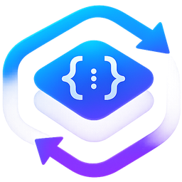
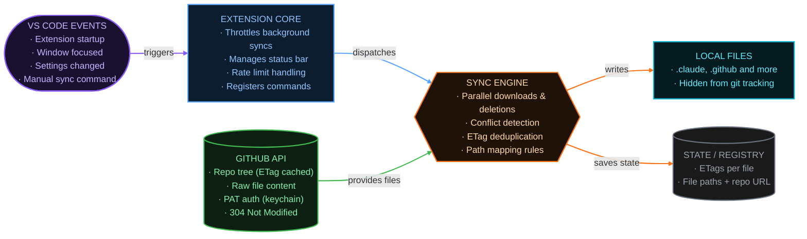

  
  <h1>AI Setup Sync</h1>
  
<strong>One repo. Every project. Always in sync.</strong>

  
  
  
  

Every AI coding tool wants its own config files in every repo. AI Setup Sync keeps one GitHub repo
as the source of truth and pulls them into each project automatically — agents, skills, commands,
MCP configs, and anything else your tools read. No copy-pasting, and nothing committed to the
project you're working in.

## Why AI Setup Sync

- **Your AI setup never touches a client's codebase** — agents, skills, commands, MCP configs,
  whatever your tools read: it all stays in your own setup repo, and every file synced from it is
  excluded from git in the projects it lands in.
- **Works with any file-based AI config** — Claude Code, Copilot, Cursor, Codex, and Antigravity
  work out of the box, MCP configs included. Custom path mappings cover anything else.
- **Never loses your work** — files you've edited locally are detected and you're prompted, with a
  built-in diff, before anything is replaced.
- **Stays out of your way** — syncs on project open and window focus, reports state in the status
  bar, and reaches every Claude Code and Codex worktree so parallel agent sessions get your setup
  too.

## Requirements

- **VS Code 1.125** or later.
- **A GitHub repository** holding your AI setup files — personal or org, public or private,
  including SAML SSO orgs and GitHub Enterprise Server.
- **For private, SSO-protected, or Enterprise Server repos:** a GitHub **classic** personal access
  token with the **`repo`** scope.

## Install

1. Install from the [VS Code Marketplace](https://marketplace.visualstudio.com/items?itemName=olekpuchka.ai-setup-sync)
   (or search **AI Setup Sync** in the Extensions view).
2. Set `aiSetupSync.repository` to your GitHub repository URL in VS Code **user** settings.
3. Open a project — sync runs automatically.

For private repos, SSO-protected orgs, or GitHub Enterprise Server, add a token — see the
[full setup guide](extension/README.md#setting-up-your-repository).

> **New here?** Open a project before configuring anything and AI Setup Sync prompts you, with a
> shortcut to the repository setting.

## Documentation

- **[Full guide](extension/README.md)** — settings, path mappings, conflict handling, post-sync
  commands, and the FAQ.
- **[Changelog](CHANGELOG.md)** — what changed in each release.
- **[Issues](https://github.com/olekpuchka/ai-setup-sync/issues)** — bug reports, questions, and
  feature requests.

## Architecture

Sync triggers on startup, window focus, and settings changes. The extension core throttles those
triggers and hands off to the sync engine, which fetches the repo tree from the GitHub API — using
an ETag so unchanged trees cost nothing — writes the files it needs to your project, and records
what it wrote so the next sync can tell your edits from its own.

[CONTRIBUTING.md](CONTRIBUTING.md#key-concepts) covers how each piece is implemented.

## Contributing

Pull requests are welcome for features, bug fixes, and documentation. See
[CONTRIBUTING.md](CONTRIBUTING.md) for local setup, project architecture, and PR guidelines.

## License

Released under the [MIT License](LICENSE).
