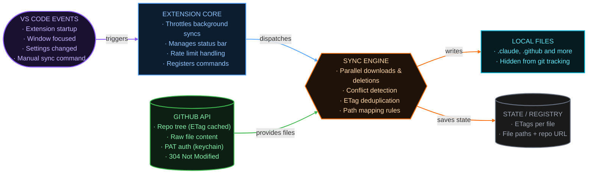

# Architecture

```mermaid
flowchart LR
    classDef vscode fill:#1a1030,stroke:#8B5CF6,stroke-width:2px,color:#C4B5FD
    classDef core   fill:#0d1d30,stroke:#58A6FF,stroke-width:2px,color:#93C5FD
    classDef sync   fill:#1f1208,stroke:#F97316,stroke-width:2px,color:#FED7AA
    classDef github fill:#0d1f13,stroke:#3FB950,stroke-width:2px,color:#86EFAC
    classDef local  fill:#061b1f,stroke:#06B6D4,stroke-width:2px,color:#67E8F9
    classDef state  fill:#1a1a1a,stroke:#6B7280,stroke-width:2px,color:#9CA3AF

    A(["VS CODE EVENTS
    · Extension startup
    · Window focused
    · Settings changed
    · Manual sync command"]):::vscode -->|triggers| B

    B["EXTENSION CORE
    · Throttles background syncs
    · Manages status bar
    · Rate limit handling
    · Registers commands"]:::core -->|dispatches| C

    D[("GITHUB API
    · Repo tree (ETag cached)
    · Raw file content
    · PAT auth (keychain)
    · 304 Not Modified")]:::github -->|provides files| C

    C{{"SYNC ENGINE
    · Parallel downloads & deletions
    · Conflict detection
    · ETag deduplication
    · Path mapping rules"}}:::sync -->|writes| E

    C -->|saves state| F

    E["LOCAL FILES
    · .claude, .github and more
    · Hidden from git tracking"]:::local

    F[("STATE / REGISTRY
    · ETags per file
    · File paths + repo URL")]:::state

    linkStyle 0 stroke:#8B5CF6,stroke-width:2px
    linkStyle 1 stroke:#58A6FF,stroke-width:2px
    linkStyle 2 stroke:#3FB950,stroke-width:2px
    linkStyle 3 stroke:#F97316,stroke-width:2px
    linkStyle 4 stroke:#F97316,stroke-width:2px
```
